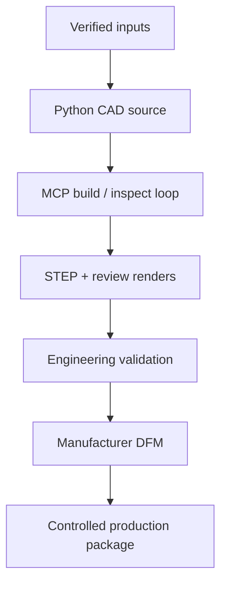

# System architecture

## Component model



## Layers

### 1. Input/evidence layer

- exact equipment model and revision;
- manufacturer manuals/datasheets and user measurements;
- dimensions, mass, power, heat, cable locations;
- fixed, moving, loading, maintenance, and ventilation envelopes;
- doorway, lift, vehicle, storage, and event-site constraints;
- chosen operating and transport modes.

Every fit-critical value stores provenance and verification state.

### 2. Domain/configuration layer

Typed project and equipment data. It distinguishes:

- a physical equipment body;
- a no-collision keep-out zone;
- a service-access zone;
- a thermal zone;
- a cable bend/connector zone;
- an operating movement envelope;
- a transport restraint envelope.

### 3. Parametric geometry layer

Expected modules after implementation:

```text
src/stand_cad/
├── schema.py
├── equipment.py
├── datums.py
├── layout.py
├── frame.py
├── shelves.py
├── panels.py
├── doors.py
├── ventilation.py
├── cable_management.py
├── hardware.py
├── assembly.py
├── drawings.py
├── bom.py
├── validation.py
└── release.py
```

Geometry builders should be pure/deterministic where practical: equal input configuration produces equivalent geometry and stable part identifiers.

### 4. Interactive CAD tool layer

`build123d-mcp` is the agent's visual/geometric feedback surface. It does not own the canonical model. The saved Python generator owns it.

Treat the MCP persistent session as transient working state. Every accepted experiment must be folded back into saved source/configuration and regenerated outside that session before review or release.

MCP responsibilities:

- incremental execution;
- named-object inspection;
- rendering;
- measurements and bounding boxes;
- hole/feature recognition where useful;
- collision/clearance investigation;
- validation before export;
- STEP/DXF/SVG/STL/drawing workflow support.

### 5. Validation layer

- config schema and release-gate tests;
- geometry validity and solid count;
- deterministic dimensions and bounding boxes;
- assembly placement and interference;
- operating/service clearance;
- mass/centre-of-mass inputs and stability evidence;
- load and thermal analyses appropriate to risk;
- drawing/BOM/part-ID consistency;
- visual snapshot review;
- dependency/reference geometry regression.

### 6. Handoff layer

Two distinct packages prevent accidental release:

- `review/`: concept and DFM communication, visibly non-production;
- `release/`: revisioned, approved outputs with manifest and sign-offs.

## Integration decision

Do not write a custom MCP in Phase 0. Add a project-specific MCP only if repeated workflows cannot be expressed safely through:

1. repository rules;
2. Python scripts/CLI;
3. existing `build123d-mcp` tools.

A later custom server would be justified only for a stable equipment catalogue, organization-specific DFM rules, or one-command production-package validation. It must wrap the same Python source, not create a parallel modeling system.
